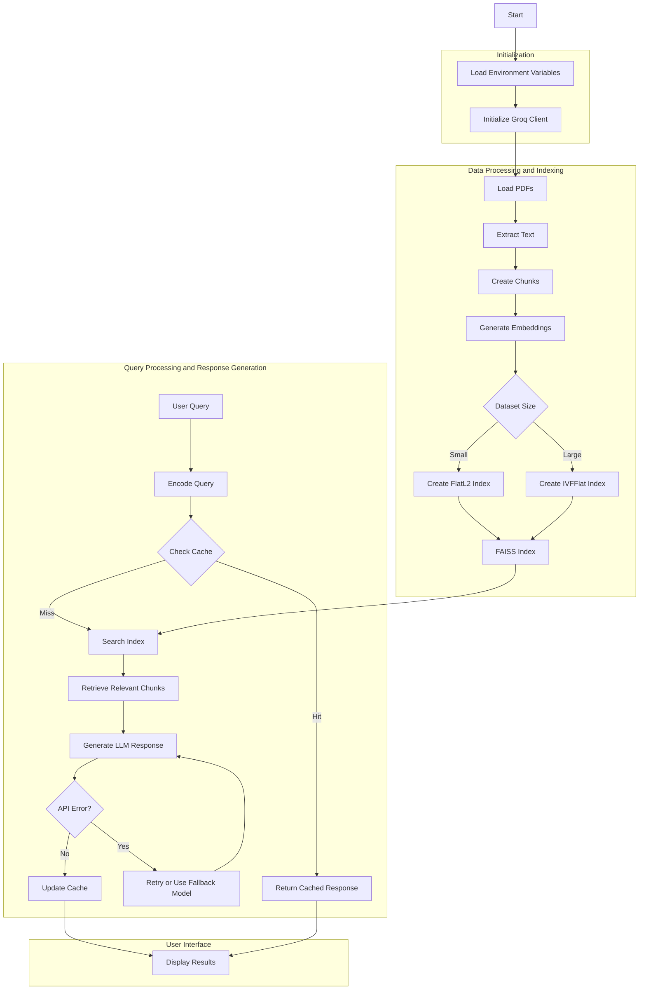
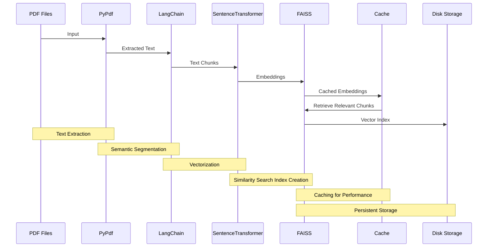
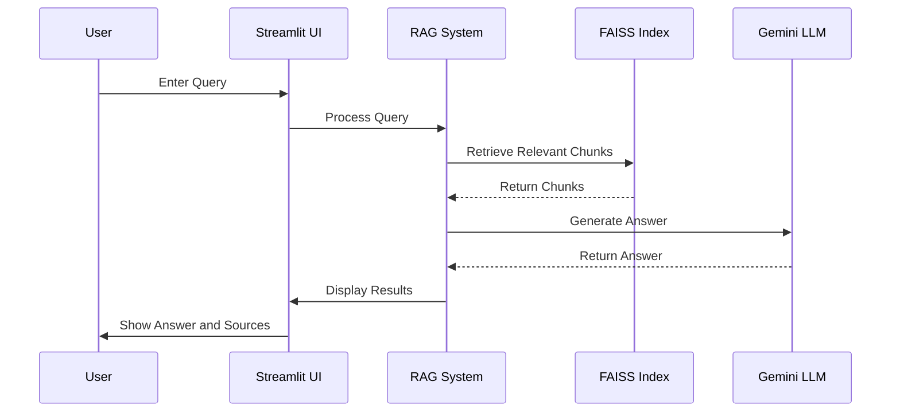

## Technical Deepdive into RAGify

This section will look at the technical implementation details of the RAGify project.
If you are eager to browse through the code yourself, jump right [here](./RAGify-full_code.ipynb).

### Visualize Full RAGify Architecture

Before diving into the details of building RAGify, here is a high-level overview of the system:



This diagram might look complex, but the RAG concept is simple. It involves processing documents, creating embeddings, storing them in a vector database, and then using AI to generate responses based on user queries.

### Setting Up RAGify Environment

First, I import the necessary libraries and set up logging:

```python
import os
import groq
from typing import List
from sentence_transformers import SentenceTransformer
import faiss
import numpy as np
from pypdf import PdfReader
from langchain.text_splitter import RecursiveCharacterTextSplitter
import json
import logging

# Set up logging
logging.basicConfig(level=logging.INFO)

# Initialize the Groq client with the API key obtained from environment variables
client = groq.Groq(
		api_key=os.environ.get("GROQ_API_KEY"),
)

# Load a pre-trained sentence transformer model for generating embeddings
model_name = 'all-mpnet-base-v2'
model = SentenceTransformer(model_name)
```

### Document Processing

#### Process Input PDF Files

Now that I have set up the development environment, my next priority is to process the PDF files that make up the [Blunder Mifflin Employee Handbook](./Blunder_Mifflin-Employee_Handbook.md).

For this step, I need to extract text content from the input PDF documents. This process transforms the unstructured data in PDFs into a format that can be easily processed and analyzed by AI.
I have placed the files inside the [input_files](./input_files/) folder.

To process these PDFs, I am using [PyPDF](https://pypdf.readthedocs.io/en/latest/index.html). It is a free and open-source Python PDF library capable of splitting, merging, cropping, and transforming the pages of PDF files.

here is the code I have written to extract text from PDFs:

```python
import os
from pypdf import PdfReader

def extract_text_from_pdf(pdf_path):
		with open(pdf_path, 'rb') as file:
				reader = PdfReader(file)
				text = ''
				for page in reader.pages:
						text += page.extract_text() + '\n'
		return text

# Process all PDF files in the specified directory
pdf_directory = './input_files/'
all_chunks = []
for filename in os.listdir(pdf_directory):
		if filename.endswith('.pdf'):
				pdf_path = os.path.join(pdf_directory, filename)
				text = extract_text_from_pdf(pdf_path)
				chunks = create_chunks(text)
				all_chunks.extend(chunks)
```

This code converts the PDF documents into plain text, preparing them for the next stages, such as text chunking and embedding creation.

#### Text Chunking with LangChain

After extracting text from Blunder Mifflin's PDF documents, I will break it down into smaller, manageable chunks. This process, known as **text chunking**, is essential for several reasons:

1. It allows for more precise information retrieval.
2. It helps maintain context within each chunk.
3. It optimizes the input size for our embedding model.

I will use LangChain's `RecursiveCharacterTextSplitter` for this step, which splits the input text while maintaining semantic coherence within each chunk.

[LangChain](https://langchain.com) is a framework designed to facilitate building applications that combine large language models (like Gemini or GPT) with other tools and data sources.
It enhances basic Large Language Models (LLMs) by connecting different components (AI, web, databases, memory, etc.) in a structured way.

For example, LangChain can be used to create a chatbot that not only answers customer queries using a language model but also accesses customer information from a database, checks order status, and remembers past interactions for more personalized support.

`RecursiveCharacterTextSplitter` is a LangChain tool that breaks down large text into smaller, more manageable chunks. This is crucial because large language models perform better with shorter text inputs. It attempts to split text at logical points, such as sentences or paragraphs, to ensure the smaller sections remain coherent.

here is how I chunk the text using RecursiveCharacterTextSplitter:

```python
from langchain.text_splitter import RecursiveCharacterTextSplitter

def create_chunks(text, chunk_size=1000, chunk_overlap=200):
		"""
		Split a large text into smaller chunks.

		Args:
		text (str): The input text to be split.
		chunk_size (int): The maximum size of each chunk.
		chunk_overlap (int): The number of characters to overlap between chunks.

		Returns:
		list: A list of text chunks.
		"""
		# Create a RecursiveCharacterTextSplitter object with specified parameters
		text_splitter = RecursiveCharacterTextSplitter(
				chunk_size=chunk_size,
				chunk_overlap=chunk_overlap,
				length_function=len,
		)
		# Split the input text into chunks
		chunks = text_splitter.split_text(text)
		return chunks

# Create chunks for all documents
all_chunks = []
```

This chunking process is vital for RAGify's performance. By breaking down Blunder Mifflin documents into smaller, overlapping pieces, I ensure that:

1. My vector database can efficiently store and retrieve relevant information.
2. I maintain local context within each chunk, improving the quality of our embeddings.
3. I optimize the input size for our embedding model, which often has token limits.

The `chunk_overlap` parameter is particularly important as it helps maintain continuity between chunks. This overlap ensures that I do not lose context at the boundaries between chunks, which could happen if I made hard cuts in the middle of sentences or paragraphs.

With our documents now split into manageable chunks, I am ready for the next step in our RAG pipeline: creating embeddings for these chunks and storing them in our vector database.

### Embedding Creation with Sentence Transformers

After chunking our documents, the next step is to create embeddings for each chunk.
[Embeddings](./readme.md#vector-database) are numerical representations of data (like text, images, or other objects) in the form of vectors (lists of numbers).
These vectors capture the meaning or features of the data, allowing databases to compare, search, and organize similar items effectively.

For RAGify, I will use the `sentence-transformers` library, which provides pre-trained models specifically designed for generating high-quality text embeddings.

The [sentence-transformers library](https://sbert.net) is a Python package that facilitates the use of transformer models (like BERT, RoBERTa, and others) for sentence and text embedding tasks.
It builds on top of the [Hugging Face Transformers library](https://huggingface.co/docs/transformers/en/index) and simplifies the process of generating dense vector representations (embeddings) for sentences, paragraphs, or entire documents.

I have previously used sentence-transformers in two of my other projects:

- [Movie-Recommendation-Bot](https://github.com/kanad13/Movie-Recommendation-Bot)
- [Emotion_Detection_App](https://github.com/kanad13/Emotion_Detection_App)

For this project, I have chosen to use the [all-mpnet-base-v2](https://huggingface.co/sentence-transformers/all-mpnet-base-v2) model to map sentences and paragraphs to a 768-dimensional dense vector space. This model is known for its high performance in various semantic similarity tasks.

here is the Python code I have written to create embeddings using the sentence-transformers library:

```python
from sentence_transformers import SentenceTransformer

# Load a pre-trained sentence transformer model for generating embeddings
model_name = 'all-mpnet-base-v2'
model = SentenceTransformer(model_name)

def create_embeddings(chunks):
		"""
		Generate embeddings for a list of text chunks.

		Args:
				chunks (list): A list of text chunks to embed.

		Returns:
				list: A list of embedding vectors.
		"""

		# Generate embeddings for all chunks
		embeddings = model.encode(chunks)

		return embeddings

# Create embeddings for all chunks
embeddings = create_embeddings(all_chunks)
```

In my implementation, each chunk is transformed into a fixed-size vector. Using the same model for both indexing and querying ensures consistent representations.

The embeddings created by this code serve as the foundation for our semantic search capability.
By converting text into dense vector representations, I can compare the similarity between different pieces of text.
This allows RAGify to quickly identify the most relevant chunks when responding to user queries, enhancing the overall performance and accuracy of the system.
In the next section, I will store these vectors in our FAISS database for fast and efficient similarity search.

### Vector Database Setup with FAISS

FAISS (Facebook AI Similarity Search) is a powerful library developed by Facebook Research for efficient similarity search and clustering of dense vectors.

[FAISS](https://github.com/facebookresearch/faiss) is particularly well-suited for RAGify because:

1. It is optimized for speed, allowing for fast similarity searches even with large datasets.
2. It supports various indexing algorithms, enabling us to balance between search speed and accuracy.
3. It can handle high-dimensional vectors, which is perfect for our embedding vectors.
4. It provides both CPU and GPU implementations for flexibility in different computing environments.

The FAISS index is selected based on the number of chunks, which dynamically adjusts the index type to optimize performance.

```python
import faiss
import numpy as np

# Create a FAISS index for efficient similarity search based on embeddings
dimension = embeddings.shape[1]
num_chunks = len(all_chunks)

# Dynamically decide on the index type based on the number of chunks
if num_chunks < 100:
		logging.info("Using FlatL2 index due to small number of chunks")
		index = faiss.IndexFlatL2(dimension)
else:
		logging.info("Using IVFFlat index")
		n_clusters = min(int(np.sqrt(num_chunks)), 100)  # Adjust number of clusters based on data size
		quantizer = faiss.IndexFlatL2(dimension)
		index = faiss.IndexIVFFlat(quantizer, dimension, n_clusters)
		index.train(embeddings.astype('float32'))

index.add(embeddings.astype('float32'))
```

In this implementation:

1. I dynamically decide whether to use the `IndexFlatL2` index for smaller datasets (fewer than 100 chunks) or the `IndexIVFFlat` index for larger datasets. The `IndexIVFFlat` index is more scalable and performs well on larger datasets by clustering the vectors.
2. For `IndexIVFFlat`, I adjust the number of clusters based on the size of the dataset, ensuring the index remains efficient even as the number of chunks increases.
3. I add our embeddings to the index using the `add` method.

By setting up this FAISS index, I have created a tool for quickly finding the most similar document chunks to any given query. This will be crucial in the next steps of our RAG pipeline, where I will use this index to retrieve relevant information in response to user queries.

### Caching Strategy for Performance Optimization

To further enhance the performance of RAGify, I have implemented a caching strategy. This allows the system to store and retrieve previously computed results, reducing the need for repetitive computations and improving response times for frequently asked questions.

- **How the Cache Works**

1. Cache Initialization

   - A cache is initialized and loaded from a JSON file (`semantic_cache.json`). This file stores previous queries, their corresponding embeddings, and the generated responses. The cache also tracks the model used to ensure consistency.

2. Cache Lookup

   - When a new query is received, the system first checks the cache to see if a similar query has been previously processed. The similarity is determined based on the distance between the new query's embedding and those stored in the cache.
   - If a match is found (within a defined threshold), the cached response is returned immediately, bypassing the need to recompute embeddings or search the vector database.

3. Cache Update

   - If the query is not found in the cache, the system processes it as usual—creating embeddings, retrieving relevant chunks, and generating a response.
   - The new query, its embedding, and the generated response are then added to the cache for future use.

4. Cache Persistence

   - The cache is periodically saved to the disk, ensuring that the data persists across different sessions.

here is how the cache is implemented:

```python
import json
import logging

# Initialize cache
cache_file = 'semantic_cache.json'

# Function to load the cache from a JSON file
def load_cache():
		try:
				with open(cache_file, 'r') as f:
						cache = json.load(f)
						if cache.get('model_name') != model_name:
								logging.info("Embedding model changed. Resetting cache.")
								return {"queries": [], "embeddings": [], "responses": [], "model_name": model_name}
						return cache
		except FileNotFoundError:
				return {"queries": [], "embeddings": [], "responses": [], "model_name": model_name}

# Function to save the cache to a JSON file
def save_cache(cache):
		with open(cache_file, 'w') as f:
				json.dump(cache, f)

# Load the cache
cache = load_cache()

# Function to retrieve a response from the cache based on query similarity
def retrieve_from_cache(query_embedding, threshold=0.5):
		for i, cached_embedding in enumerate(cache['embeddings']):
				if len(cached_embedding) != len(query_embedding):
						logging.warning("Cached embedding dimension mismatch. Skipping cache entry.")
						continue
				distance = np.linalg.norm(query_embedding - np.array(cached_embedding))
				if distance < threshold:
						return cache['responses'][i]
		return None

# Function to update the cache with a new query, embedding, and response
def update_cache(query, query_embedding, response):
		cache['queries'].append(query)
		cache['embeddings'].append(query_embedding.tolist())
		cache['responses'].append(response)
		cache['model_name'] = model_name
		save_cache(cache)
```

By integrating this caching mechanism, RAGify can efficiently handle repeated queries, reducing the computational load and delivering faster responses to the user.

### RAG - Retrieval Workflow

This step involves retrieving relevant chunks of information based on a user's query and using them to generate an informed response.
The core of our RAG system is the ability to find the most relevant information from our document collection. I have implemented this using the following function:

```python
def retrieve_relevant_chunks(query, top_k=10):
		query_vector = model.encode([query])[0]

		cached_response = retrieve_from_cache(query_vector)
		if cached_response:
				logging.info("Answer recovered from Cache.")
				return cached_response

		top_k = min(top_k, len(all_chunks))  # Ensure we do not request more chunks than available
		D, I = index.search(np.array([query_vector]).astype('float32'), top_k)
		relevant_chunks = [all_chunks[i] for i in I[0]]

		update_cache(query, query_vector, relevant_chunks)
		return relevant_chunks
```

This function performs the following steps:

1. Encodes the user's query into a vector using the same SentenceTransformer model I used for our documents.
2. Searches the FAISS index for the `top_k` most similar vectors to the query vector.
3. Returns the corresponding text chunks from our original document set.
4. If the query is found in the cache, the system returns the cached response instead of performing the search again.

The `top_k` parameter allows me to control how many relevant chunks I retrieve, balancing between comprehensive context and computational efficiency.

### Visualize Caching aspect of RAGify

This section is kind of a summary of the topics handled till now.
First look at the diagram below



This diagram shows the flow of my RAG system:

1. **Text Extraction** - PDF files are processed by PyPdf to extract raw text.
2. **Semantic Segmentation** - LangChain breaks down the extracted text into meaningful chunks.
3. **Vectorization** - SentenceTransformer converts text chunks into numerical embeddings.
4. **Similarity Search Index Creation** - FAISS organizes these embeddings for efficient retrieval.
5. **Caching for Performance** - Similar queries and responses are cached to improve response time.
6. **Persistent Storage** - The FAISS index is saved to disk for future use.

When a query is received, the system uses this prepared index to quickly retrieve relevant information, which is then used to augment the LLM's response. The next section will cover the LLM part.

### Response Generation using LLM

After setting up our vector database and implementing the retrieval of relevant chunks, the final step in our RAG system is to generate informed responses based on the retrieved information.

A Large Language Model generates contextual responses to your questions. For this project, I used the 8B model from the [Meta Llama 3.1 collection](https://github.com/meta-llama/llama-models/blob/main/models/llama3_1/MODEL_CARD.md), served by [Groq Cloud](https://wow.groq.com/why-groq/). However, the code can be easily customized to use other models like [OpenAI](https://platform.openai.com/docs/guides/chat-completions) or [Gemini](https://ai.google.dev/gemini-api/docs).

```python
import os
import groq
from typing import List

client = groq.Groq(api_key=os.environ.get("GROQ_API_KEY"))

def generate_response(query: str, relevant_chunks: List[str], model: str = "llama-3.1-8b-instant") -> str:
		context = "\n".join(relevant_chunks)
		prompt = f"""Based on the following context, please answer the question. If the answer is not fully contained in the context, provide the most relevant information available and indicate any uncertainty.

Context:
{context}

Question: {query}

Answer:"""

		chat_completion = client.chat.completions.create(
				messages=[
						{
								"role": "system",
								"content": "You are a helpful assistant that answers questions based on the given context."
						},
						{
								"role": "user",
								"content": prompt
						}
				],
				model=model,
				temperature=0.7,
				max_tokens=1024,
				top_p=1,
				stream=False,
				stop=None
		)

		response = chat_completion.choices[0].message.content.strip()
		usage_info = chat_completion.usage
		logging.info(f"Usage Info: {usage_info}")
		return response, usage_info
```

This function performs the following steps:

1. **Prompt Preparation** - It combines the retrieved relevant chunks into a single context string and formats a prompt that includes this context along with the user's query.
2. **API Call** - It uses Groq's API to generate a response. The `llama-3.1-8b-instant` model is used by default, but this can be customized.
3. **Response Extraction** - The generated response is extracted from the API's return value and cleaned up.

- **Define RAG Query**

And then this is the cherry on top - this function kind of ties it all together:

```python
def rag_query(query: str, top_k: int = 10) -> str:
		relevant_chunks = retrieve_relevant_chunks(query, top_k)
		response, usage_info = generate_response(query, relevant_chunks)
		# Uncomment the following line to log usage information
		# print(f"Usage Info: {usage_info}")
		return response
```

1. It retrieves the most relevant chunks using our previously implemented `retrieve_relevant_chunks` function.
2. It then passes these chunks along with the original query to the `generate_response` function.
3. Finally, it returns the generated response.

- **Testing the system locally**

To verify that our RAG system is working as expected, I use a test query:

```python
test_query = "Describe Blunder Mifflin's remote work policy?"
result = rag_query(test_query)
print(f"Query: {test_query}")
print(f"Response: {result}")
```

You will get an answer based on text from the Blunder Mifflin Employee Handbook.

### Streamlit App

Finally, to make RAGify accessible to non-technical users, I have built a user-friendly interface using Streamlit.

This section outlines how to set up and use the Streamlit app for querying your documents.

```python
def main():
		st.title("RAGify - Chat with Your Documents")
		st.write("Ask questions about your company's documents and get AI-powered answers.")

		# Process PDFs and create index
		# This calls our previously defined functions to process the PDFs and create the FAISS index. Note that these functions are decorated with StreamlIt is caching decorators (`@st.cache_data` and `@st.cache_resource`) to optimize performance.
		all_chunks, chunk_to_doc = process_pdfs()
		index = create_faiss_index(all_chunks)

		# User input
		user_query = st.text_input("Enter your question:")

		if st.button("Get Answer"):
				if user_query:
						with st.spinner("Generating answer..."):
								response, usage_info, source_docs = rag_query(user_query, index, all_chunks, chunk_to_doc)
			# When the user clicks the "Get Answer" button, this code checks if a query has been entered. If so, it calls our `rag_query` function to process the query. The `st.spinner` provides visual feedback while the answer is being generated.

						# Display the response
						st.subheader("Answer:")
						st.write(response)

						# Display the source documents
						st.subheader("Source Documents:")
						for doc in source_docs:
								st.write(f"- {doc}")
						# This section displays the generated answer, lists the source documents used to create the answer, and provides detailed usage information in an expandable section.

						# Display usage information
						with st.expander("Usage Information"):
								st.json(usage_info)
				else:
						st.warning("Please enter a question.")
```

### Visualize user engagement of RAGify

This diagram demonstrates how the end-user flow looks like.


