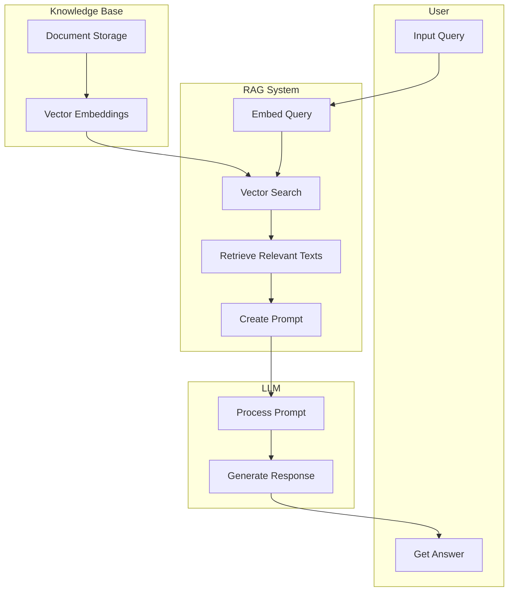
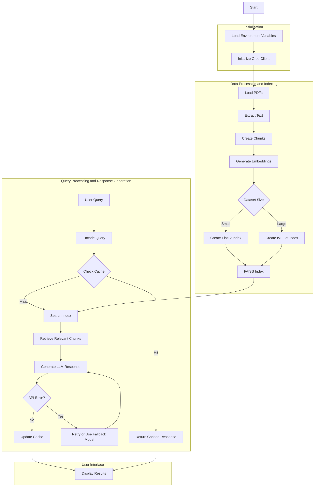
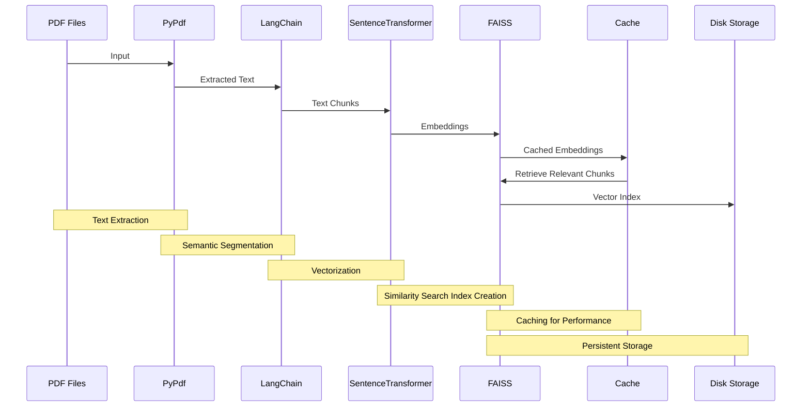
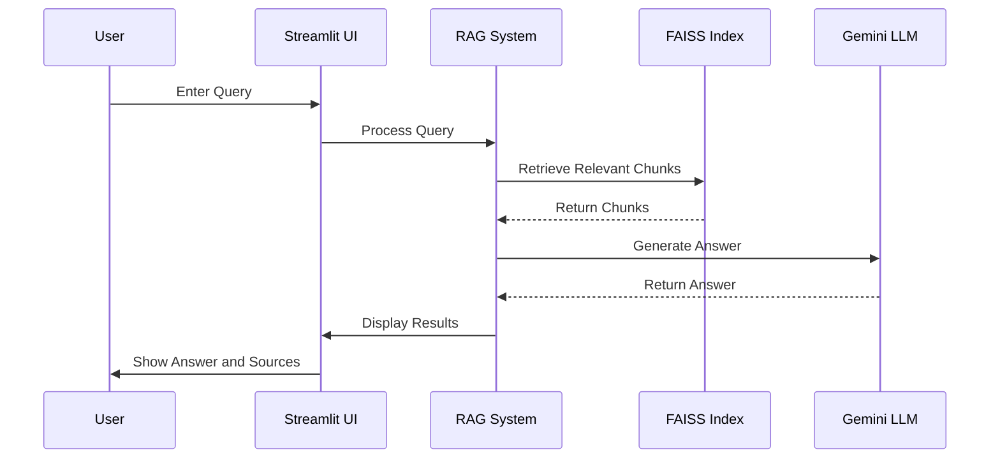
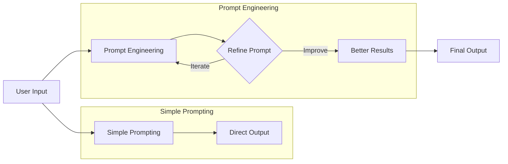
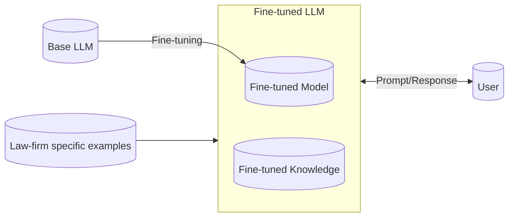
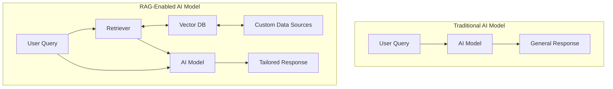
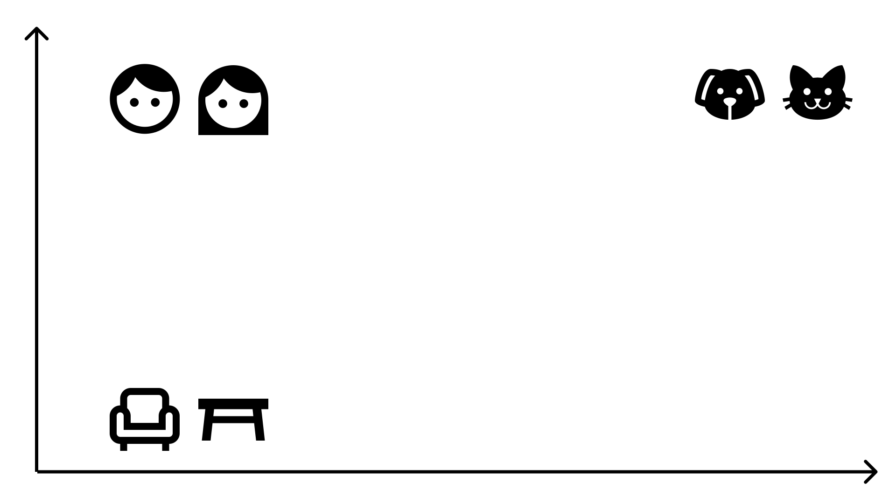
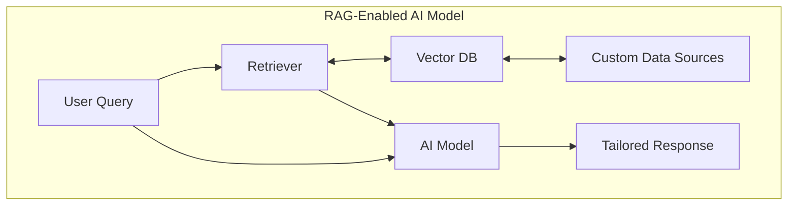

# RAGify - Turn Your Documents into an Interactive AI Assistant

Ever wanted to chat with your company's documents? RAGify makes it possible.

This github repository is for RAGify - a tool that transforms your internal documents into an interactive Q&A system. It uses two key technologies:

1. Retrieval-Augmented Generation (RAG)
2. Large Language Models (LLMs)

Think of RAGify as giving your PDFs a brain, without compromising your confidential data.

[Click here to see RAGify in action on some sample documents.](https://ragify.streamlit.app)

## Why RAGify?

Every company has a vast amount of documentation spread across various file formats like PDF and DOCX. Wouldn't it be great if you could chat with these documents?
If you use ChatGPT or Gemini to upload yourn documents to chat with them, then that risks making your company's confidential information public.

RAGify provides an alternative by showing you how to:

- Build a secure system that works with your internal documents
- Integrate with trusted external entities
- Maintain the confidentiality of your corporate data

RAGify offers a simple, secure way to bring your static documents to life using the power of Generative AI.

## Customize RAGify for Your Needs

This Github repository provides detailed documentation on how RAGify works.

With this information, you can quickly adapt RAGify to suit your needs.

By making a few changes, RAGify can work with your own documentation.

Scroll below to see how you can build a similar system.

## How RAGify Works?



Here is a simple overview of the diagram above:

1. The user asks a question.
2. The RAG system converts this question into a numerical format (vector) that computers can understand and compare easily.
3. It then searches through a database of pre-converted document vectors to find the most relevant information.
4. The system retrieves the actual text of these relevant documents.
5. It combines the user's question with this relevant information to create a detailed prompt.
6. This prompt is sent to an AI (the LLM), which processes it and generates a response.
7. Finally, the user receives this response as their answer.

## What is covered in this repository?

1. [RAGify - Turn Your Documents into an Interactive AI Assistant](#ragify---turn-your-documents-into-an-interactive-ai-assistant)
   1. [Why RAGify?](#why-ragify)
   2. [Customize RAGify for Your Needs](#customize-ragify-for-your-needs)
   3. [How RAGify Works?](#how-ragify-works)
   4. [What is covered in this repository?](#what-is-covered-in-this-repository)
   5. [Key Components of RAGify](#key-components-of-ragify)
   6. [Input Documents - Blunder Mifflin](#input-documents---blunder-mifflin)
   7. [Uniqueness of RAGify Architecture](#uniqueness-of-ragify-architecture)
   8. [RAGify Technical Deepdive](#ragify-technical-deepdive)
   9. [Simple Explanations for Complex Terms](#simple-explanations-for-complex-terms)
   10. [RAG with your own documents](#rag-with-your-own-documents)
   11. [Acknowledgements](#acknowledgements)

## Key Components of RAGify

- **Large Language Model (LLM) to generate context-aware responses.**
  - My project uses Groq's API to interact with the large language model, specifically 8B model from the [Meta Llama 3.1 collection](https://github.com/meta-llama/llama-models/blob/main/models/llama3_1/MODEL_CARD.md).
  - This model is served by [Groq Cloud](https://wow.groq.com/why-groq/) and is responsible for producing intelligent and contextually relevant responses based on the retrieved chunks of text from the input documents.
  - The code can be easily customized to use other models like `OpenAI`, `Mistral`, or `Gemini`.
- **Sentence Transformers to generate embeddings for text chunks and queries.**
  - The `SentenceTransformer` model [all-mpnet-base-v2](https://huggingface.co/sentence-transformers/all-mpnet-base-v2) is used to create dense vector embeddings from the text data extracted from PDFs.
  - These embeddings are crucial for semantic search, allowing the system to find the most relevant text chunks corresponding to a user's query.
- **FAISS (Facebook AI Similarity Search) to perform similarity search over large datasets**
  - FAISS is employed to perform fast and accurate nearest neighbor searches among the generated embeddings.
  - Depending on the number of chunks, different FAISS index types (`IndexFlatL2` for small datasets or `IndexIVFFlat` for larger datasets) are dynamically selected to balance speed and accuracy.
- **PyPDF for pdf extraction**
  - Usage - The `PdfReader` from the [pypdf library](https://pypdf.readthedocs.io/en/latest/index.html) is used to read and extract text content from PDF files, which is then processed and chunked for further analysis.
  - This allows the system to work with document-based data sources.
- **Langchain for text chunking and splitting.**
  - The `RecursiveCharacterTextSplitter` from [Langchain](https://python.langchain.com/v0.1/docs/modules/data_connection/document_transformers/recursive_text_splitter/) is used to break down large chunks of text into smaller, more manageable pieces.
  - This facilitates efficient processing and ensures that the text chunks are of an appropriate size for embedding and retrieval.
- **Caching Mechanism to speed up query responses by reusing previous results.**
  - The system includes a JSON-based caching mechanism to store previous queries, their embeddings, and responses.
  - Before generating a new response, the system checks the cache to see if a similar query has already been processed.
  - If found, the cached response is returned, significantly improving response time and reducing the need for redundant computations.
- **Streamlit for creating a web-based user interface.**
  - Streamlit is used to create an interactive web application that allows users to input queries and view responses generated by the system.
  - It provides an intuitive and easy-to-deploy interface for users to interact with the RAG system without needing to run the code manually.

## Input Documents - Blunder Mifflin

Now that I have explained some complex terms about Retrieval-Augmented Generation, let me get back to RAGify - the project to understand how you can use a chatbot on your own documents.

To showcase how RAGify works with LLM on custom documents, I created the Employee Handbook for a fictional company called Blunder Mifflin.

The chatbot answers questions related to the company policy.\n

So for example, if an employee of Blunder Mifflin wants to know what is the "Work from Home" policy, then they can just ask the chatbot that question and get the answer using the power of Generative AI.

If the company's Work From Home policy gets updated, they just update the documents, no changes needed to the chatbot. The chatbot starts providing answers based on latest information.

This approach allows me to explore the functionality of RAGify without using real, sensitive data.

The [5 PDF documents](/input_files/) include:

1. Blunder Mifflin's History and Mission
2. Blunder Mifflin's Employee Handbook
3. In-Office Relationships Policy
4. Prank Protocol
5. Birthday Party Committee Rules

In the next few sections, I will use these 5 documents as sample input to demonstrate how RAGify can turn static information into an interactive, AI-driven Q&A system. By feeding these PDFs into the RAGify system, you will be able to ask questions like:

- "What is Blunder Mifflin's mission?"
- "What's the policy on in-office relationships?"
- "How should pranks be conducted at Blunder Mifflin?"

RAGify will process these documents, breaking them down into manageable chunks, and store them for quick retrieval.
When you ask a question, RAGify searches through these chunks to find the most relevant information, then uses AI to craft a clear and concise response.

This code will show how you can use RAG to handle your own company's documents.

## Uniqueness of RAGify Architecture

- **Source Attribution**
  - Responses from RAGify are accompanied by sources and specific document chunks used:
    - Provides users insight into the origins of the response, enhancing transparency and trust.
    - Utilizes the `chunk_to_doc` mapping for clear traceability.
    - [Link](https://github.com/kanad13/RAGify/blob/5554ea8a72ea6e43924c1043d29c9111bb38416d/pages/02-Chatbot.py#L254) to relevant code.
- **Adaptive FAISS Indexing**
  - The system selects the most suitable FAISS index based on dataset size:
    - Utilizes a `FlatL2` index for precise results on smaller collections.
    - Switches to an `IVFFlat` index with optimized clustering for efficient search in larger datasets.
    - This adaptability ensures optimal performance with low latency, regardless of dataset size.
    - [Link](https://github.com/kanad13/RAGify/blob/5554ea8a72ea6e43924c1043d29c9111bb38416d/pages/02-Chatbot.py#L110) to relevant code.
- **Multi-Level Caching Strategy**
  - RAGify employs a multi-tiered caching approach to optimize performance:
    - I have implemented a semantic cache that stores and retrieves results based on embedding similarity. This reduces API calls and improves response times for similar queries.
    - Streamlit's `@st.cache_data` decorator caches processed PDF content for efficiency.
    - Vector embeddings are cached using `@st.cache_resource` to enhance retrieval speed and avoid recomputation.
    - A custom semantic cache stores and retrieves responses for similar queries, thus accelerating repeated tasks.
    - Relevant code: `@st.cache_data` for `process_pdfs`, `@st.cache_resource` for `create_faiss_index`, and the custom semantic cache in `load_cache`, `save_cache`, `retrieve_from_cache`, and `update_cache` functions.
- **Hash-Based Dynamic Cache Invalidation**
  - RAGify implements a sophisticated, hash-based cache invalidation mechanism:
    - A hash of all input files is computed on each run.
    - When the hash changes, indicating updated content, all relevant caches are automatically invalidated and rebuilt.
    - This approach ensures the system always works with the most current information, minimizing downtime and resource usage.
    - [Link](https://github.com/kanad13/RAGify/blob/5554ea8a72ea6e43924c1043d29c9111bb38416d/pages/02-Chatbot.py#L62) to relevant code.
- **Hybrid Model Approach**
  - I have implemented a primary and fallback model system approach. So if one endpoint is unavailable or if one model hits the rate limits, then the code automatically falls back to another endpoint.
  - [Link](https://github.com/kanad13/RAGify/blob/5554ea8a72ea6e43924c1043d29c9111bb38416d/pages/02-Chatbot.py#L188) to relevant code.
- **Detailed documentation**
  - I have included detailed explanations for my code along with Mermaid diagrams to make it easy to maintain the documentation as the code changes.
    - Link to [relevant documentation](#ragify-technical-deepdive).

## RAGify Technical Deepdive

### Full RAGify architecture

Before diving into the details of building RAGify, here is a high-level overview of the system:



### Visualize Caching aspect of RAGify

This diagram shows the flow of my RAG system:

1. **Text Extraction** - PDF files are processed by PyPdf to extract raw text.
2. **Semantic Segmentation** - LangChain breaks down the extracted text into meaningful chunks.
3. **Vectorization** - SentenceTransformer converts text chunks into numerical embeddings.
4. **Similarity Search Index Creation** - FAISS organizes these embeddings for efficient retrieval.
5. **Caching for Performance** - Similar queries and responses are cached to improve response time.
6. **Persistent Storage** - The FAISS index is saved to disk for future use.

When a query is received, the system uses this prepared index to quickly retrieve relevant information, which is then used to augment the LLM's response. The next section will cover the LLM part.



### Visualize user engagement of RAGify

This diagram demonstrates how the end-user flow looks like.



## Simple Explanations for Complex Terms

This section explains some of the complex terms used in this project.

1. [Prompt Engineering](./readme.md#prompt-engineering)
2. [Fine-tuning](./readme.md#fine-tuning)
3. [Retrieval-Augmented Generation (RAG)](./readme.md#retrieval-augmented-generation-rag)
4. [Vector Database](./readme.md#vector-database)
5. [Retriever](./readme.md#retriever)

### Prompt Engineering

The questions you ask a Generative AI model (e.g., ChatGPT, Gemini) are called "prompts." To get better answers, you must "engineer" or "refine" your prompt.

Example - Instead of saying "Write about dogs," say "Write a 200-word paragraph about the history of domesticated dogs, focusing on their roles in human society."



### Fine-tuning

Fine-tuning makes an AI model better at specific tasks. It is like teaching a smart student to become an expert in a new subject.

Let us say a law firm needs to create many legal documents every day. ChatGPT can write these documents, but it might not use the right words or the right format, that the law firm needs.

To fix this, the law firm can "fine-tune" the AI model. This means teaching the AI to write documents exactly how the law firm wants them.

To do this, the firm shows the AI model some examples of perfect legal documents written by their best lawyers. The AI learns from these examples and gets better at writing documents just like the law firm wants.



### Retrieval-Augmented Generation (RAG)

RAG allows you to feed the AI model your own data sources, enabling it to give more relevant and tailored responses.

Imagine a pizza restaurant's chatbot using RAG. It is like giving the chatbot a constantly updated menu card. When customers ask about today's specials, changed delivery zones, or new toppings, the chatbot can instantly access this fresh information. It does not just rely on old data but can pull up the latest details.



### Vector Database

A Vector Database is a smart storage system for AI. It helps AI access new or specific information not included in its original training.

A vector database is like a smart library where instead of searching for books by their title or author, you are searching by the ideas inside the books. This helps the AI find and compare information more effectively.

Let me reuse the example from the previous section about the chatbot for a pizza restaurant. The restaurant keeps its latest menu in a Vector Database. When customers ask about new pizzas, the chatbot can quickly check this database for current information. This way, the restaurant does not need to constantly update the chatbot. They just add new pizza details to the database, and the chatbot can access this information when needed.

Vector databases store data differently from relational databases like MySQL. Instead of using rows and columns, vector databases convert each piece of data into a numerical format called an embedding. These embeddings are placed in a multi-dimensional space. Similar items are positioned closer together.

For example, "cats" and "dogs" would be near each other, while "table" and "chair" would be further apart. This method helps AI models provide more relevant answers.



### Retriever

The Retriever in a RAG system works like a smart search tool. It helps connect what users ask with the information stored in "vector databases".

When someone asks a question, the Retriever does three main things:

1. **Find Similar Info**: It looks for information that is close to what the user asked.

2. **Sort by Importance**: It puts the found information in order, with the most useful stuff at the top.

3. **Pick the Best**: It chooses the top pieces of information to send back to the AI.

The AI then uses this information to give an answer the user can easily understand.



## RAG with your own documents

In just a few steps, you can set up the RAG system for your own documents. Follow the instructions below:

### Install Prerequisites

- **Python** - Install Python by following [this guide](https://wiki.python.org/moin/BeginnersGuide/Download).
- **Git** - Install Git by following [these instructions](https://docs.github.com/en/get-started/getting-started-with-git/set-up-git).

### Clone the Repository

Clone the RAGify repository to your local machine:

```bash
git clone https://github.com/kanad13/RAGify.git
cd RAGify
```

### Create a Virtual Environment

Create a virtual environment to manage dependencies:

```bash
python -m venv rag_venv
```

Activate the virtual environment:

- On Windows:

```sh
.\rag_venv\Scripts\activate
```

- On Mac:

```sh
source rag_venv/bin/activate
```

### Install Required Packages

Install all the necessary Python packages:

```bash
pip install -r requirements.txt
```

### Set Up LLM

RAGify utilizes the open-source Meta Llama model, hosted by Groq. To use it, you'll need an API key. Follow [these instructions](https://console.groq.com/docs/quickstart) to obtain your key.

If you prefer using a different LLM, you can obtain API keys from the following providers:

- [OpenAI](https://platform.openai.com/docs/quickstart)
- [Gemini](https://ai.google.dev/gemini-api/docs)
- [Anthropic](https://docs.anthropic.com/en/docs/quickstart)
- [Mistral](https://docs.mistral.ai/api/)

Alternatively, you can set up an LLM on your own machine using:

- [GPT4All](https://github.com/nomic-ai/gpt4all)
- [Llama.cpp](https://github.com/ggerganov/llama.cpp)
- [LocalAI](https://github.com/mudler/LocalAI)

### Configure API Key

Once you have your API key, create a `.env` file in the root directory of the cloned repository. Add the following line to the `.env` file:

```text
GROQ_API_KEY="your_key"
```

This key will be loaded at runtime into the RAGify system, keeping it private and secure on your machine. The [python-dotenv package](https://pypi.org/project/python-dotenv/) handles this process.

### Prepare Your Input Files

Place all your documents inside the `input_files` folder. You may remove the existing files if needed.

### Access the RAGify Application

You are now ready to interact with your documents. You have two options:

- **Option 1**: Run the code in a Jupyter notebook if you're technically inclined. See the notebook [here](./RAGify-full_code.ipynb).
- **Option 2**: Access the system via a Streamlit web app. Open a terminal, navigate to the root of the repository, and run the following command:

```bash
streamlit run Welcome.py
```

## Acknowledgements

RAGify is powered by a combination of open and closed-source technologies. I am grateful for the contributions of the following initiatives and organizations:

- [Python](https://github.com/python) - The backbone of RAGify's codebase.
- [PyPDF](https://pypdf.readthedocs.io/en/latest/index.html) - It is used for text extraction and processing from PDF documents.
- [Hugging Face](https://huggingface.co/sentence-transformers/all-mpnet-base-v2) - The `all-mpnet-base-v2` SentenceTransformer model is used to generate embeddings for semantic search.
- [Facebook](https://faiss.ai) - Facebook AI Similarity Search (FAISS) is used for performing similarity searches.
- [Langchain](https://python.langchain.com/v0.1/docs/modules/data_connection/document_transformers/recursive_text_splitter/) - This RecursiveCharacterTextSplitter is used for breaking down large text into manageable chunks, optimizing them for embedding and retrieval.
- [Meta](https://github.com/meta-llama/llama-models/blob/main/models/llama3_1/MODEL_CARD.md) - The Llama 3.1 8B Model serves as the LLM behind RAGify's intelligent responses.
- [Groq](https://wow.groq.com/why-groq/) - The LLM is hosted on Groq Language Processing Unit and inferences are provided through an API.
- [Streamlit](https://streamlit.io/) - Streamlit provides the technology to build and host the RAGify chatbot.
- **The Broader AI/ML Community** - A special thanks to the AI/ML community whose ongoing research and open-source contributions have laid the foundation for this project.
